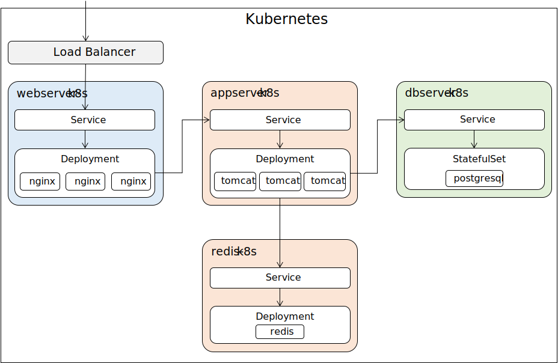

# k8s-webapp-sample

## Preface
This project is a sample for running the web application on Kubernetes.
The web application consists of three layers: Web, App, DB.

For more information about this application, see:

- Web
  - [vuejs-webapp-sample](https://github.com/ybkuroki/vuejs-webapp-sample)
- App
  - [springboot-webapp-sample](https://github.com/ybkuroki/springboot-webapp-sample)

## Architecture
This sample deployed three layers to three services : webserver-k8s-service, appserver-k8s-service, dbserver-k8s-service.
There are three pods in the each service, but DB service is only one.
Different middleware and applications are deployed on each pod.
Web pods run a Vue.js application on Nginx, App pods run a Spring Boot application on Tomcat. The DB pod uses PostgreSQL.



## Requirements
The following requirements for running are required:

- Windows10 Home
- Minikube
- Virtual box

## Install
Perform the following steps:

1. Download and install [Virtual Box](https://www.virtualbox.org/wiki/Downloads).
1. Download [kubectl](https://kubernetes.io/docs/tasks/tools/install-kubectl/) Command and Add the binary in to your PATH.
1. Download and install [Minikube](https://kubernetes.io/ja/docs/tasks/tools/install-minikube/).

## Starting this sample on Kubernetes
Perform the following steps:

1. Start minikube.
1. Create docker images.
1. Create deployments and services.
1. Access LoadBalancer's URL in your browser and confirm that this application has started.
1. Delete deployments and services.
1. Stop minikube.
1. Delete minikube cluster.

### Start minikube
```bash
# start minikube
minikube start --vm-driver=virtualbox

# check that minikube is runnning
minikube status

# check kube-system's pods
kubectl get pods --all-namespaces
```

### Create docker images
```bash
# check docker-env. set docker environment variable.
minikube docker-env

# build docker images
docker build -t appserver_k8s:1.2 -f k8s/app/Dockerfile .
docker build -t dbserver_k8s:1.0 -f k8s/db/Dockerfile .
docker build -t webserver_k8s:1.0 -f k8s/web/Dockerfile .
```

### Create deployments and services
```bash
# redis
kubectl apply -f k8s/redis/deployment.yaml
kubectl apply -f k8s/redis/service.yaml

# db
kubectl apply -f k8s/db/statefulset.yaml
kubectl apply -f k8s/db/service.yaml

# apserver (For Local environment)
kubectl apply -f k8s/app/deployment.yaml
kubectl apply -f k8s/app/service.yaml

# web
kubectl apply -f k8s/web/deployment.yaml
kubectl apply -f k8s/web/service.yaml

# LB
kubectl apply -f k8s/lb/loadbalancer.yaml

# check deployed pods
kubectl get pods

# check deployed services
kubectl get services

# check all services and pods
kubectl get all

# check LoadBalancer's URL
minikube service nginx-lb-k8s --url
```

### Access a container of a pod
```bash
# db server
kubectl exec -it dbserver-k8s-sfs-0 --container dbserver -- psql -U testusr testdb

# app server
kubectl exec -it appserver-k8s-67dbd4f8b8-z5f6v --container appserver -- /bin/bash

# web server
kubectl exec -it webserver-k8s-54b64f8dc-gdn8l --container nginx -- /bin/bash
```

### Delete deployments and services
```bash
# delete all services and pods
kubectl delete all --all

# or perform the following commands
# redis
kubectl delete -f k8s/redis/deployment.yaml
kubectl delete -f k8s/redis/service.yaml

# db
kubectl delete -f k8s/db/statefulset.yaml
kubectl delete -f k8s/db/service.yaml

# apserver
kubectl delete -f k8s/app/deployment.yaml
kubectl delete -f k8s/app/service.yaml

# web
kubectl delete -f k8s/web/deployment.yaml
kubectl delete -f k8s/web/service.yaml

# LB
kubectl delete -f k8s/lb/loadbalancer.yaml
```

### Commands for troubleshooting
```bash
# summary for any pod
kubectl describe pods [pod name]
# summary for any service
kubectl describe services [service name]

# check log of any pod
kubectl logs [pod name]
```

### Stop minikube
```bash
minikube stop
```

### Delete minikube cluster
```bash
minikube delete
```

## Project Mapping
The follwing figure is the map of this sample project.

```
- k8s                   ... Define yml for Kubernetes.
  - app                 ... Define deployments for application service.
  - db                  ... Define deployments for database service.
  - lb                  ... Define deployments for load balancer.
  - redis               ... Define deployments for redis.
  - web                 ... Define deployments for web service.
- springboot-k8s-sample ... This source are deployed on application service.
```

## License
The License of this sample is *MIT License*.
